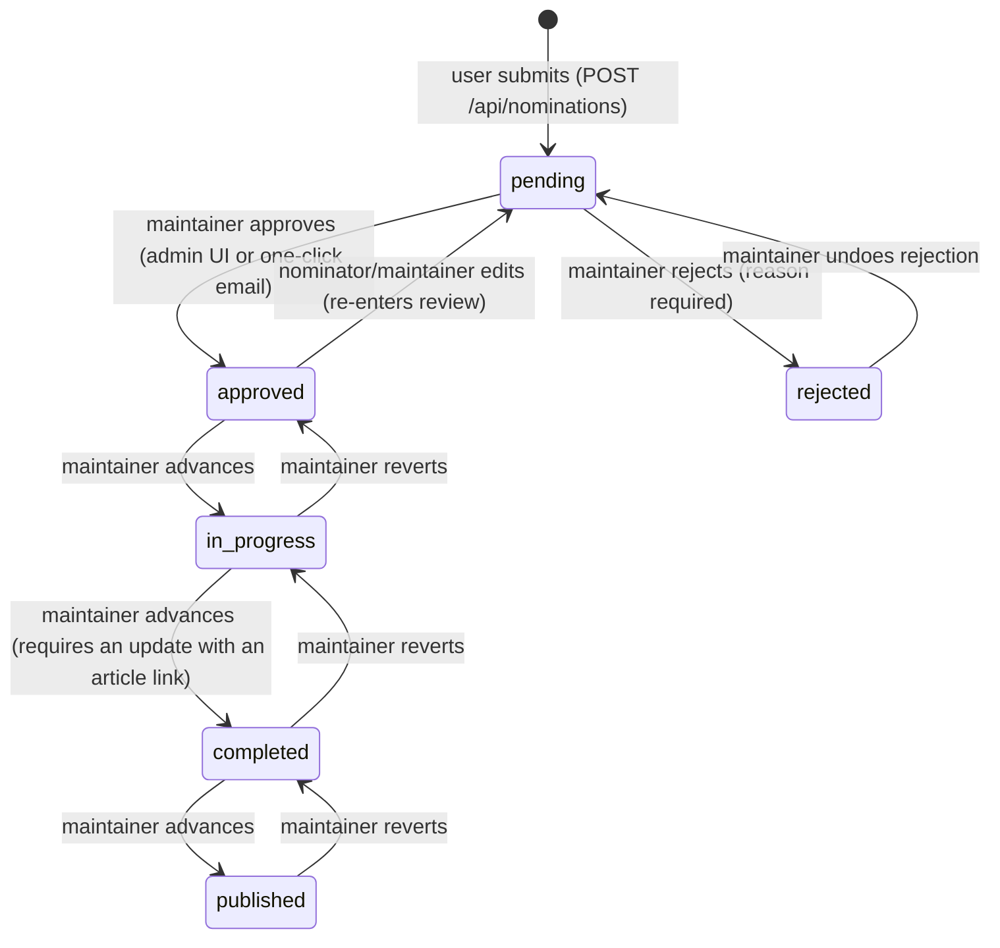

# Replicate This — System Reference

Everything the system does and stores, in one place: the nomination lifecycle,
the full database schema, roles and permissions, notifications, integrations,
and the privacy model. For the *why* behind the architecture decisions, see
[ARCHITECTURE.md](ARCHITECTURE.md).

- **Stack:** React SPA (`web/`, Vite + React Router + TanStack Query + Tailwind)
  → Hono API (`server/`, Better Auth + Drizzle) → Postgres. The SPA never
  touches Postgres; all authorization happens in API route handlers.
- **Dev URLs:** web `http://localhost:5173` (port pinned; auth trusts only this
  origin), API `http://localhost:8787`, Vite proxies `/api` → `8787`.

---

## 1. Nomination lifecycle

### States

| Status | Meaning | Publicly visible? |
|---|---|---|
| `pending` | Submitted, awaiting maintainer review. Shown with an **"Under Review"** tag. | Yes |
| `approved` | Reviewed and open for contributors ("Open"). | Yes |
| `in_progress` | A replication team is actively working. | Yes |
| `completed` | The replication/reproduction is done; a linked article exists. Terminal (may still advance to published). | Yes |
| `published` | The resulting study is formally published. Terminal. | Yes |
| `rejected` | Declined by a maintainer (reason required). Hidden from the registry; visible only to the nominator and maintainers. | No |

### Transitions

Rules enforced in code:

- **Submission** (`server/src/routes/nominations.ts`): DOI required and
  deduplicated — a DOI can only be re-nominated if the previous nomination was
  `rejected`. Reference metadata is fetched from Crossref, falling back to
  doi.org content negotiation, falling back to manual entry (`metadataManual`).
  Justification must be ≥ 20 characters.
- **Approval** (`server/src/lib/moderation.ts`): flips `pending → approved`,
  logs to `moderation_logs`, notifies the nominator and subscribers, and — when
  the Slack integration is configured — creates the team's locked Slack channel.
  Shared by the admin UI and the one-click email review flow.
- **Rejection** requires a written reason (stored in `moderation_logs.reason`
  and sent to the nominator). The email flow only rejects still-`pending`
  nominations; the admin API can reject at later statuses too.
- **Editing** (`PATCH /api/nominations/:id`): allowed for the nominator or a
  maintainer while status is `pending` or `approved`. The DOI and fetched
  reference are immutable (a different paper = a new nomination). **Every edit
  sends the nomination back to `pending`** for re-review.
- **Lifecycle advance/revert** (`POST /api/admin/nominations/:id/status`):
  maintainers may set `approved | in_progress | completed | published`.
  Reverting to an earlier status is always allowed. Advancing to `completed`
  is gated: the team must first post a progress update carrying an
  `articleUrl` (the "completion request").
- Every moderation action writes a row to `moderation_logs`.

### The replication team

- **Contributing** is auto-accepted (no approval handshake): any signed-in user
  except the nominator can join via `POST /api/contributions/:id`, optionally
  with a pitch message, and may withdraw at any time.
- **The team** (nominator + contributors + maintainers) can post progress
  updates. An update with an article link asks maintainers to mark the study
  completed.
- **Slack**: once a nomination has a locked Slack channel (created at
  approval), contributors and the nominator can request an invite (see § 6).

---

## 2. Database schema

Schema source: [`server/src/db/schema.ts`](../server/src/db/schema.ts).
Migrations in `server/drizzle/` (`npm run db:generate` → `db:migrate`; local
dev DBs are typically synced with `db:push`).

### Auth tables (Better Auth)

**`user`** — one row per account, pseudonymous by design (see § 7):

| Column | Type | What it stores |
|---|---|---|
| `id` | text PK | Better Auth's random, non-identifying id. First 8 chars double as the public "researcher token" (`#eFpGkVB`). |
| `name` | text | Random pseudonym (e.g. `BrightQuasar42`), never the OAuth profile name. User-editable; unique case-insensitively among non-deleted users. |
| `email` | text unique | **Not a real email** — deterministic dummy `<hmac>@privacy.forrt.org` derived from the provider email (or ORCID iD) with `EMAIL_PEPPER`. Exists only so one person links across providers. |
| `email_verified` | boolean | Always true (providers verified the underlying address). |
| `image` | text | Always null (stripped). |
| `role` | text | `user` \| `maintainer`. Never settable by the client; granted via the admin UI (guardrails: no self-change, never zero maintainers). |
| `deleted` | boolean | Soft-delete tombstone: login severed, PII cleared, name becomes "Deleted account"; the user's content remains attributed to that tombstone. |
| `links` | jsonb | **Opt-in** public contact links: `orcid` (checksum-validated, canonicalised), `github`, `twitter`, `linkedin`, `website` (http(s)-validated, ≤ 300 chars). |
| `notification_email` | text | **Opt-in, user-volunteered** address for email notifications. Empty = no emails. The only real email the system ever stores, by explicit choice. |
| `email_prefs` | jsonb | Which categories to email: `my_nominations`, `contributions`, `watched`, `admin` (maintainers only). All off by default. |
| `created_at`, `updated_at` | timestamp | |

**`session`** — `id`, unique signed `token`, `expires_at`, `ip_address`,
`user_agent`, `user_id` (cascade). Cookie: `replicate-this.session_token`,
httpOnly, sameSite=lax, secure in prod.

**`account`** — one row per linked OAuth provider: `provider_id`
(google/github/orcid), `account_id` (the provider's user id), OAuth
`scope`. Accounts resolving to the same dummy email are linked automatically.
The `access_token` / `refresh_token` / `id_token` columns exist because Better
Auth's account model defines them, and are always null: `account.create.before`
and `account.update.before` hooks discard the provider tokens before every
write (`server/src/lib/oauth-tokens.ts`), so neither first sign-in, repeat
sign-in nor account linking persists one. A Google `id_token` is a JWT carrying
the real email, name and picture; the app makes no provider calls after
sign-in, so nothing needs the tokens.

**`verification`** — Better Auth's short-lived OAuth state/PKCE rows.

### Application tables

**`nominations`** — the registry's core row:

| Column | Type | What it stores |
|---|---|---|
| `id` | uuid PK | |
| `doi` | text unique | Normalised DOI. Immutable after submission. |
| `metadata` | jsonb | Cached reference: `title`, `authors[]`, `journal`, `publication_date`. From Crossref/doi.org, or manual entry. Journal may be overridden by the submitter. |
| `metadata_manual` | boolean | True when the reference was hand-entered (DOI lookup failed). |
| `discipline` | text | One of: Psychology, Medicine, Economics, Biology, Physics, Sociology, Education, Linguistics, Marketing, Neuroscience, Other. |
| `verification_type` | text | `replication` (new data) \| `reproduction` (re-analyse original data/code) \| `both` (either / not sure). |
| `availability` | jsonb string[] | What the nominator says is open: `open_data`, `open_code`, `open_materials`, `preregistration`, `open_access`. |
| `availability_links` | jsonb | Optional http(s) URL per availability key (e.g. `{ open_data: "https://osf.io/…" }`). |
| `justification` | text | Why this paper deserves a second look (≥ 20 chars). |
| `data_location` | text | Where the original data/code live (reproductions). |
| `robustness_checks` | text | Suggested alternative specifications (optional). |
| `design_deviations` | text | For replications: how the new design should differ (optional). |
| `replication_games` | boolean | Nominator-set tag: suits a one-day Replication Games event (Institute for Replication hackathons). Shown as a hoverable tag chip. |
| `slack_channel_id` / `slack_channel_name` | text | The team's locked Slack channel, created at approval when the integration is configured. Empty = none. Only the *name* is exposed to the client. |
| `nominator_uid` | text FK → user (set null) | |
| `status` | text | Lifecycle state (§ 1). |
| `last_milestone` | integer | Highest upvote milestone already alerted to admins (prevents re-alerts). |
| `last_activity_at` | timestamptz | Bumped by updates/comments; drives "Most active" sort. |
| `created_at` | timestamptz | |

**`votes`** — "I want this replicated" upvotes. PK (`nomination_id`,
`user_uid`); row presence = an upvote; toggled on/off. Login required, no
account-age gate. Milestone counts trigger one-time admin alerts.

**`predictions`** — "will it replicate?" forecasts. PK (`nomination_id`,
`user_uid`) + `will_replicate` boolean. Shown as an aggregate yes/no
distribution; changeable or clearable by the voter.

**`contributions`** — auto-accepted intent to replicate. PK (`nomination_id`,
`contributor_uid`) + unique `id`, optional `message` (pitch: expertise, lab,
timeline). The public roster shows pseudonym + token + message.

**`comments`** — public, Reddit-style threaded discussion: `parent_id`
(null = top-level), `author_uid`, `content`, `hidden` (maintainer moderation —
kept for audit, not shown publicly).

**`subscriptions`** — GitHub-style "watch". PK (`nomination_id`, `user_uid`).
Subscribers get notifications for comments, updates, contributors, and status
changes (except for activity they caused themselves).

**`nomination_updates`** — progress updates from the team (2–5000 chars).
`article_url` non-empty ⇒ doubles as a **completion request** that alerts
maintainers.

**`inquiries`** — private "contact the team" messages: `sender_uid`,
`content`, `delivery_status`, `read_at`. Recipients (nominator + contributors)
are notified in-app.

**`notifications`** — the in-app inbox: `user_uid`, `type` (§ 5), `data`
jsonb (usually `{ nominationId, … }`), `read_at`.

**`moderation_logs`** — audit trail of every admin action: `admin_uid`,
`nomination_id` (nullable — role changes have none), `action` (e.g.
`approved`, `rejected`, `undo_rejection`, `set_status_completed`,
`revert_status_approved`, `edited`, `hide_comment`, `grant_maintainer`),
`reason`.

### Derived — deliberately *not* stored

- **Target-journal tags** (R², Journal of Robustness Reports, JCRE,
  ReScience C, ReScience X) are computed on the fly from discipline /
  verification type / availability (`web/src/features/nominations/journal-tags.ts`),
  so rule changes retroactively update every card.
- **Researcher token** = first 8 chars of the user id, derived at read time.
- **Aggregates** (upvotes, prediction split, contribution/comment/subscriber
  counts) are `count(*)` joins in `server/src/db/queries.ts`, never denormalised.

---

## 3. Roles & permissions

| Action | Signed-out | User | Nominator (own study) | Contributor | Maintainer |
|---|---|---|---|---|---|
| Browse registry, read comments/updates | ✅ | ✅ | ✅ | ✅ | ✅ |
| Nominate / upvote / predict / comment / subscribe | — | ✅ | ✅ | ✅ | ✅ |
| Contribute to a study | — | ✅ | — (already the nominator) | withdrawn only | ✅ |
| Edit a nomination (while pending/approved) | — | — | ✅ | — | ✅ |
| Post progress updates | — | — | ✅ | ✅ | ✅ |
| Join the study's Slack channel | — | — | ✅ | ✅ | — |
| Send an inquiry to the team | — | ✅ | — | — | ✅ |
| Approve / reject / set lifecycle status | — | — | — | — | ✅ |
| Hide comments, manage user roles | — | — | — | — | ✅ |
| See rejected nominations | — | — | own only | — | ✅ |

---

## 4. API surface

All routes live under `/api` (`server/src/app.ts`). Session is resolved for
everything except `/api/auth/*` (Better Auth) and `/api/email-actions/*`
(signed-token auth).

| Router | Endpoints |
|---|---|
| `/api/auth/*` | Better Auth: sign-in (Google, GitHub, ORCID), session, sign-out. |
| `/api/nominations` | `GET /` public list · `GET /mine` · `GET /:id` detail · `GET /:id/contributors` · `POST /` submit · `PATCH /:id` edit |
| `/api/votes` | `POST /:id/toggle` upvote |
| `/api/predictions` | `PUT /:id` set/clear yes-no prediction |
| `/api/contributions` | `POST /:id` join · `DELETE /:id` withdraw · `GET /mine` |
| `/api/comments` | `GET /:id` threaded list · `POST /:id` comment/reply (no user deletion; maintainers hide via admin) |
| `/api/subscriptions` | `POST /:id/toggle` watch |
| `/api/updates` | `GET /:id` timeline · `POST /:id` post update (+ completion request) |
| `/api/inquiries` | `POST /:id` message the team |
| `/api/notifications` | inbox list / mark read |
| `/api/profile` | get/update pseudonym (uniqueness-checked), contact links (ORCID checksum-validated), notification email + prefs; account deletion (soft) |
| `/api/slack` | `POST /nominations/:id/join` — invite the signed-in team member into the study's locked channel (§ 6) |
| `/api/admin` | moderation queue, approve/reject/undo, lifecycle status, user list + role management, comment moderation |
| `/api/email-actions` | one-click approve/reject from maintainer review emails, authenticated by a signed token (HMAC, 14-day expiry) instead of a session |
| `/api/health`, `/api/providers` | liveness; which OAuth providers are configured |

---

## 5. Notifications & email

Every event lands in the **in-app inbox** (`notifications` table). Email is
**strictly opt-in** twice over: the user must volunteer a `notification_email`
*and* enable the category. Sending is best-effort (Postmark; disabled when
`POSTMARK_API_TOKEN` is blank) and never fails the request.

| Category (pref) | Types |
|---|---|
| `my_nominations` | `nomination_approved`, `nomination_rejected`, `nomination_completed`, `nomination_published`, `nomination_admin_edited` |
| `contributions` | `new_contribution`, `new_inquiry` |
| `watched` | `watched_comment`, `watched_update`, `watched_contribution`, `watched_status` |
| `admin` (maintainers) | `new_nomination`, `nomination_edited`, `completion_requested`, `upvote_milestone` |

Maintainer review emails for new/edited nominations embed the study details
plus per-recipient **one-click approve/reject buttons** (signed tokens, 14-day
expiry, `server/src/lib/email-actions.ts`).

---

## 6. Integrations

### DOI / reference lookup
Crossref first, then doi.org content negotiation, then manual entry
(`server/src/lib/crossref.ts`). The journal can be overridden by the submitter.

### Slack (community discussion channels)
- **On approval**, a **locked (private) channel** is created in the community
  workspace, named after the paper title with a `-discussion` suffix (80-char
  Slack limit; `name_taken` collisions retried with a nomination-id fragment).
  Creation is fail-safe — Slack problems never block moderation.
- **Joining:** contributors and the nominator see a "Slack discussion" panel on
  the study page. They enter the email on their Slack account; the server calls
  `users.lookupByEmail` and `conversations.invite`. **The email is used once
  and never stored.**
- **No Slack account yet:** Slack's API cannot create accounts or force-add
  workspace members on standard plans, so the user gets the standing workspace
  invite link (`SLACK_INVITE_URL`), joins, then retries — the channel invite
  then completes automatically.
- **Backfill:** `npm run slack:backfill` creates channels for studies approved
  before the integration was configured (optionally one id as an argument).
- Requires a Slack app with bot scopes `groups:write`, `users:read`,
  `users:read.email`; the bot must stay in the channels it creates.

### Postmark (email) — § 5. EU data region; blank token disables email.

### Weekly public export
`.github/workflows/weekly-export.yml` (Mondays 06:00 UTC, or manual) runs
`npm run export:data` and commits `exports/nominations.json` (full public
registry) and `exports/STATS.md` (totals by status/discipline).

---

## 7. Privacy model (zero-PII)

- **At sign-in**, `mapProfileToUser` + a `user.create.before` hook replace the
  OAuth profile before any write: random pseudonym, deterministic dummy email,
  no image (`server/src/auth.ts`). Google/GitHub sign-in requests only
  openid/email scopes; ORCID only `openid`.
- **Public attribution** is pseudonym + 8-char token only.
- **User-volunteered PII** is the only PII by design: optional contact links
  and the optional notification email — both user-entered, both removable.
- **Transient PII:** the Slack-account email (§ 6) is forwarded to Slack's API
  and never persisted.
- **Account deletion** is a soft delete: credentials severed, PII cleared,
  name → "Deleted account"; contributions/comments/votes remain under the
  tombstone so threads stay coherent.
- **Sessions** store `user_agent` (and have an `ip_address` column).
- **OAuth tokens** are discarded at sign-in and never stored (see § 2).

---

## 8. Environment variables

From [`server/src/lib/env.ts`](../server/src/lib/env.ts) /
[`.env.example`](../server/.env.example). Dev fallbacks exist for everything
except where noted; production must set them all.

| Variable | Purpose |
|---|---|
| `NODE_ENV`, `PORT` | Runtime mode; API port (default 8787). |
| `DATABASE_URL` | Postgres connection string. |
| `WEB_ORIGIN` | Public web origin — CORS **and** the only origin auth trusts. Port drift ⇒ 403s on sign-in (web port is pinned via `strictPort`). |
| `BETTER_AUTH_URL`, `BETTER_AUTH_SECRET` | Auth base URL; cookie/token signing secret (≥ 32 chars). |
| `UID_PEPPER`, `EMAIL_PEPPER` | Secret peppers for the zero-PII derivations. Stable — rotating breaks account linking. |
| `GOOGLE_/GITHUB_/ORCID_CLIENT_ID/SECRET` | OAuth providers; unset pairs simply hide that sign-in button. |
| `ADMIN_EMAIL` | Shared inbox for admin alerts. |
| `POSTMARK_API_TOKEN`, `POSTMARK_FROM_EMAIL` | Transactional email; blank token = email disabled. |
| `SLACK_BOT_TOKEN` | Community workspace bot token; blank = Slack integration disabled. Read at server start — restart after changing. |
| `SLACK_INVITE_URL` | Standing workspace invite link (expires — rotate periodically). |

---

## 9. Operational notes

- **Migrations:** `npm run db:generate` after schema changes; production applies
  with `db:migrate`, local dev typically `db:push`.
- **Seed/demo data:** `npm run db:seed` / `db:demo`; `npm run make-admin`
  grants the maintainer role.
- **Tests:** `npm test` in `server/` (tokens, Slack client, Crossref) and
  `web/`.
- **`.env` is read once at startup** — restart the API after editing it.
